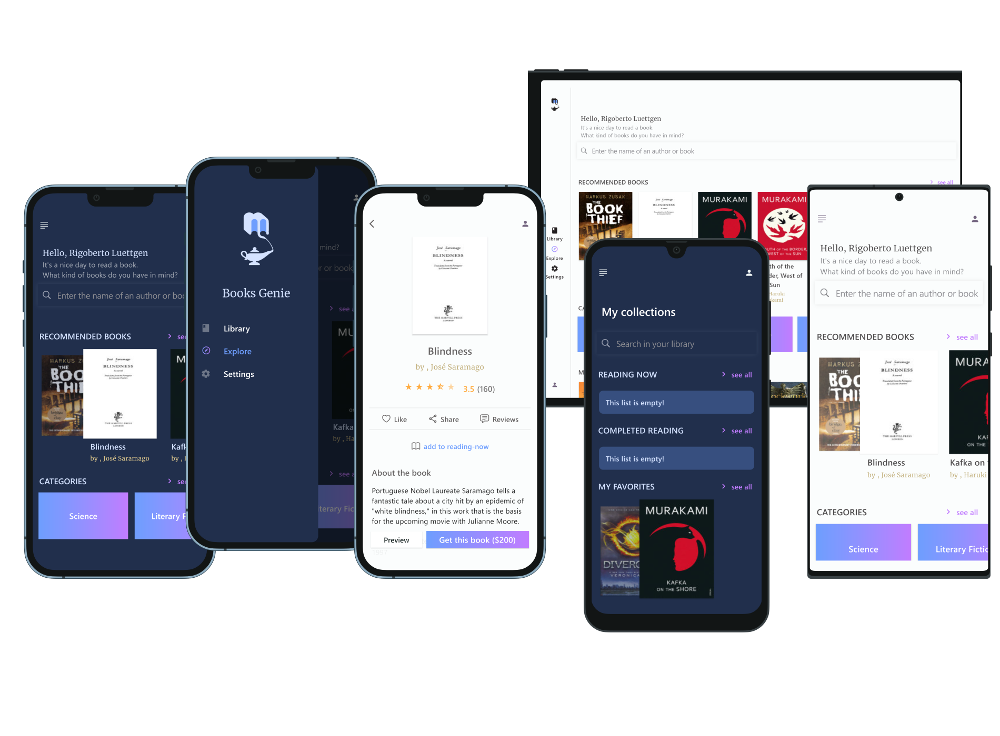
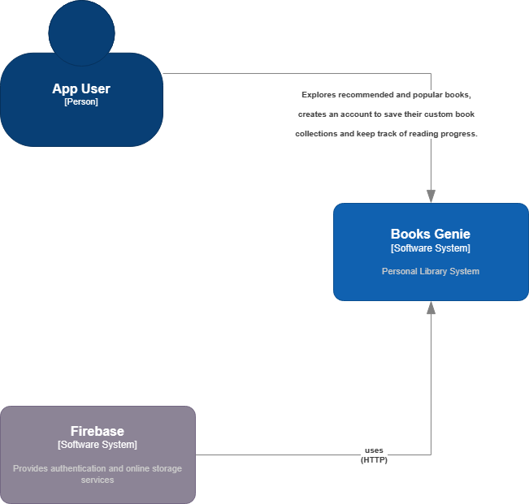
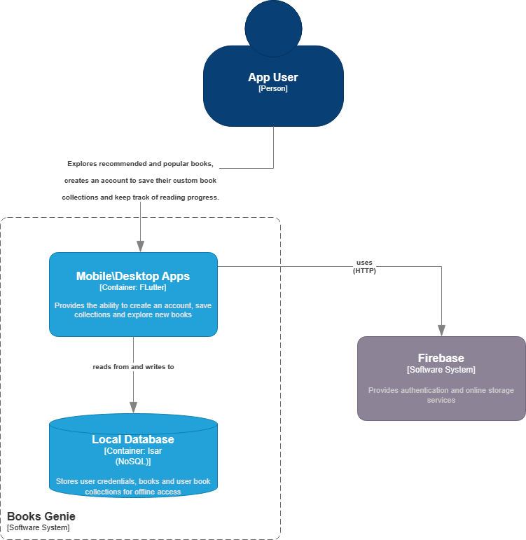
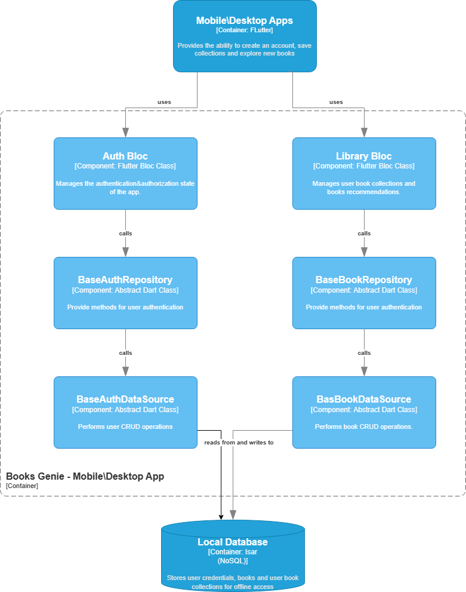

<div align="center">

</div>
<div align="center"><h2><i>Books Genie</i></h2></div>
<br/><br/>
<details>
  <summary><b>Table of Contents</b></summary>
  
- [About](#about)
  - [Screenshots](#screenshots)
- [Download](#download)
- [Built-With](#built-with)
- [Documentation](#documentation)
  - [System Design \& Architecture](#system-design--architecture)
  - [Diagrams](#diagrams)
  - [Features](#features)
- [Project Status](#project-status)
- [Build From Source](#build-from-source)
  - [Prerequisites](#prerequisites)
    - [Setup](#setup)
- [License](#license)
</details>

## About

**Books Genie** is:

- A cross-platform app built with Flutter.
- An easy way to keep track of your favorite books and novels.
- Designed with a beautiful, engaging and minimal UI.  

### Screenshots



## Download

To preview the app, you can download it for your device OS from:
 <p align="center" style="align-items:center">
 <a href="https://github.com/DMouayad/BooksGenie/releases/tag/V1.0.0" rel="GitHub Releases">
 </a>
</p>

## Built-With

- **Flutter**
    >For help to get started with Flutter development, view the [online documentation](https://docs.flutter.dev/).

  - **State Management**: [BloC](https://bloclibrary.dev/).
  - **Offline Storage**: [Isar](https://isar.dev/).
  - **Cloud & Offline Storage**: [Firebase](https://firebase.google.com/docs/).

- **GoogleBooks API**
  - using [books_finder](https://pub.dev/packages/books_finder) package.

## Documentation

### System Design & Architecture

- The design of this app is a custom combination of *Clean Architecture* and *DDD*.
- Using this approach, it was possible to allow the user to dynamically change the way to save his books preferences and
collections.

### Diagrams

#### C4 model 

<details>  
  <summary>view</summary>

| System Context Diagram|
| -------------- |
| |

| Container Diagram |
| -------------- |
| |

| Component Diagram |
| -------------- |
| |

</details>

- open in [app.diagrams](https://shorturl.at/aepqK)

### Features

- Recommendations and popular publications.
- Books search.
- Personal books collections(favorite - reading now - have read).

- Multi-Language Support

  |   Language   |  Status |
  |:---------:|:---------:|
  | Arabic        | ⏳    |
  | English        | ✔   |
  
- Multi-Platform Support:

  | Platform | Supported | Adaptive UI/UX Implemented |
  |:--------:|:---------:|:--------------------------:|
  | Android  |     ✔     |             ✔             |
  |   IOS    |     ✔     |             ✔            |
  | Windows  |     ✔     |             ⏳             |

- Multi-storage-option Support:

  | Option | Offline | Cloud |
  |:--------:|:---------:|:--------------------------:|
  | Isar  |     ✔     |             ❌             |
  |   Firebase    |     ✔     |             ✔            |

## Project Status

- This project is a **work-in-progress**.

## Build From Source

### Prerequisites

- If you are new to Flutter, start with the [installation instruction](https://flutter.io/docs/get-started/install).

- Flutter v3.10 & Dart v3.0 - or higher.

- For running on *Windows*, please read the following [requirements](https://docs.flutter.dev/development/platform-integration/desktop#requirements).

- Run the command `flutter doctor -v` in a terminal to make sure no issues are present.

### Setup

**Step 1:** download or clone this repo.

**Step 2:** run these commands in the terminal:

- `cd path_of_project_folder`
- `flutter pub get`

### Running the app

**Option 1**

- Open the project in an IDE.
- Select the device you wish to run the app on.
- Run `lib\main.dart`.

**Option 2:**

- In the project directory, run in the terminal one of the commands:

  ```dart
      flutter run -d windows
      flutter run -d macos
      flutter run -d android
      flutter run -d ios
  ```  

**Run Additional Info**

You can also specify the build mode of the app:

- Using an IDE: most IDEs support different build\run modes. check your IDE's *Run Settings & Configuration*.

- Using the terminal, specify the argument after `flutter run` from the following:

  - `-d` or `--debug`: to run the debug-version.
  - `-r` or `--release`: to run the deployment(release) version.

## License

Books Genie is open-sourced software licensed under the [MIT license](https://opensource.org/licenses/MIT).
